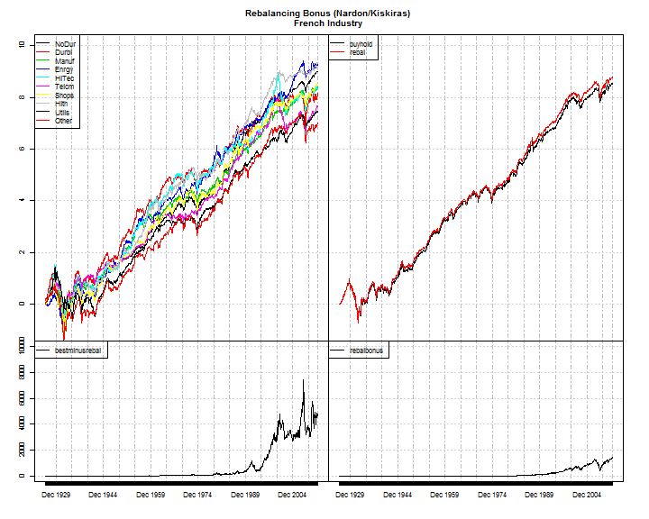
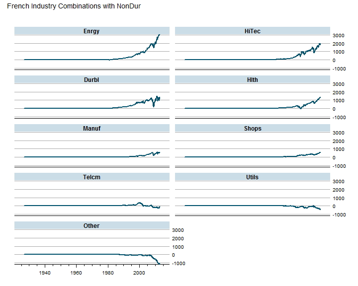

<h2 class="content-subhead">Introduction</h2>
I have always been taught that rebalancing is good.  However, it seemed few really understood the mystery of rebalancing or even explored if rebalancing is universally positive as believed.  The research that I read seemed to leave lots of unanswered questions, such as when does rebalancing work best and what combinations of investments produce the most rebalancing bonus or premium.  Last year John Kiskiras and Andrea Nardon published a paper that is easily the most enlightening that I have ever read.

<blockquote>
Kiskiras, John and Nardon, Andrea<br>
<strong>Portfolio Rebalancing: A Stable Source of Alpha</strong><br> <em>January 18, 2013</em><br>
Available at SSRN: <a href="http://ssrn.com/abstract=2202736">http://ssrn.com/abstract=2202736</a>
<br><br>
<strong>Abstract: </strong>In this work we verify that portfolio rebalancing can generate an excess return under certain market conditions. In line with existing measures, developed specifically to capture that alpha (Rebalancing Bonus), we show that high volatility as well as low correlation maximize the magnitude of the excess return. However, in contrast to previous works, we demonstrate that the actual driver and therefore sufficient condition for a Rebalancing Bonus is the presence of relative mean-reversion.
</blockquote>

The authors utilize various simulations first to demonstrate some holes from previous research and then extend the simulations with Geometric Brownian Bridges (GBB) to conclude,

<blockquote>
"Based on these results we
conclude that in order to generate a positive RB it is essential that the securities have relative
mean-reversion characteristics, and the more persistent the mean-reversion is, the higher the RB (<small><em>Rebalancing Bonus</em></small>) will be."<br>
</blockquote>

and then with sequenced Geometric Brownian Bridges and varying allocation weights,

<blockquote>
We find that in the presence of mean-reversion, the equally-weighted allocation outperforms other combinations of fixed-weights allocation. Furthermore, the equally weighted allocation together with high volatilities and low correlations result to a maximum RB.
</blockquote>

The authors then apply these findings to real markets using 4 equally weighted MSCI Country Indexes (Chile, Indonesia, Malaysia and Mexico).  Their chart in Exhibit 11 best summarizes their results.

<embed src="./assets/img/exhibit11.svg" type="image/svg+xml" />

<h2 class="content-subhead">Do It In R</h2>

For the avid R user, you will notice this is a Matlab, not an R plot.  The authors kindly offered their Matlab code, but as a learning challenge I decided to try to do it on my own in R.  Once I had some R code, I could extend their research to other combinations of investments, and of course, explore it interactively with [rCharts](http://rcharts.io).

<h4>Rebalancing Premium with French Industry Dataset</h4>
I have professed [my love in multiple posts](http://timelyportfolio.blogspot.com/search/label/french) for the [Kenneth French Dataset](http://mba.tuck.dartmouth.edu/pages/faculty/ken.french/data_library.html).  Let's use it again to see what combination of industries offers the most historical rebalancing premium.

We will start by getting the data.


```r
#get very helpful Ken French data
#for this project we will look at Industry Portfolios

require(PerformanceAnalytics)
require(quantmod)
require(xtsExtra)

#my.url will be the location of the zip file with the data
my.url=
  "http://mba.tuck.dartmouth.edu/pages/faculty/ken.french/ftp"
industries = 10 #change to 12,17,30,38,48 if want more industries
my.file = paste0(
  "/",
  industries,
  "_Industry_Portfolios_daily.zip"
)
#this will be the temp file set up for the zip file
my.tempfile <- paste(tempdir(),"\\frenchindustry.zip",sep="")
#my.usefile is the name of the txt file with the data
my.usefile <-  paste(
  tempdir(),
  paste0("\\",industries,"_Industry_Portfolios_daily.txt"),
  sep=""
)
download.file(
  paste0(my.url,my.file),
  my.tempfile, method="auto", 
  quiet = FALSE, mode = "wb",cacheOK = TRUE
)
unzip(my.tempfile,exdir=tempdir(),junkpath=TRUE)

#read space delimited text file extracted from zip
french_industry <- read.table(
  file=my.usefile,
  header = TRUE, sep = "",
  as.is = TRUE,
  skip = 9, nrows=22881
)

#get dates ready for xts index
datestoformat <- rownames(french_industry)
datestoformat <- paste(
  substr(datestoformat,1,4),
  substr(datestoformat,5,6),
  substr(datestoformat,7,8),
  sep="-"
)

#get xts for analysis
french_industry_xts <- as.xts(
  french_industry[,1:NCOL(french_industry)],
  order.by=as.Date(datestoformat)
)

#divide by 100 to get percent
french_industry_xts <- french_industry_xts/100

#delete missing data which is denoted by -0.9999
french_industry_xts[
  which(french_industry_xts < -0.99,arr.ind=TRUE)[,1],
  unique(
    which(french_industry_xts < -0.99,arr.ind=TRUE)[,2])
] <- 0
```


Once we have the data, let's set it up for rebalancing.  Rebalancing can occur on any periodic basis.  For this example I will choose rebalancing monthly with no trading costs.  To evaluate other periods, change `on="months"` to `"days", "weeks", "months", "quarters", and "years"`.


```r
#make a function
#get cumulative of individual components as price
#endpoints will determine periodic rebalancing
#so if you want something other than monthly
calcrebal <- function(data, rebal.period = "months") {
  data.cumul <- data.frame(
    lapply(
      cumprod(1+data),
      FUN=function(x){
        x[endpoints(x,on=rebal.period),]
      }
    )
  )
  
  data.cumul <- as.xts(
    data.cumul,
    orderBy=as.Date(
      index(
        data[endpoints(data,on=rebal.period),]
      )
    )
  )
  colnames(data.cumul) <- colnames(data)
  
  
  #get the returns for a non rebalanced portfolio
  #starting point will be cumulative return for each by themselves
  #so just divide all the monthly values by the beginning value
  bh.cumul <-
    data.cumul /
    matrix(
      data.cumul[1,],
      nrow=NROW(data.cumul),
      ncol=NCOL(data.cumul),
      byrow=TRUE
    )
  #test our calculation graphically
  #should look exactly the same except scale
  #plot.zoo(merge(bh.cumul,data.cumul),nc=2)
  #now let's calculate cumulative at the portfolio level
  #multiple all by 1/N or 1/ncol for equal-weighting
  #then sum by row
  portfolio <- list()
  portfolio$bh <- as.xts(
    apply(
      bh.cumul * 1/NCOL(bh.cumul),
      MARGIN = 1,
      FUN = sum
    ),
    orderBy = as.Date(index(bh.cumul))
  )
  #get the returns for a monthly rebalanced portfolio
  #since we are looking at monthly, we get monthly returns
  #then multiply each by 1/NCOL then sum returns by row
  #get monthly returns
  rebal.cumul <- data.cumul/
    lag(data.cumul,k=1)-1
  #make first 0 instead of NA to start at 1
  rebal.cumul[1,] <- 0
  portfolio$rebal <- as.xts(
    cumprod(apply(
      rebal.cumul * 1/NCOL(rebal.cumul),
      MARGIN = 1,
      FUN = sum) + 1
    ),
    orderBy = as.Date(index(rebal.cumul))
  )
  
  #get all indexes in same format,
  #same class, etc. so merge will be proper
  index(portfolio$bh) <- 
    index(portfolio$rebal) <- 
    index(data.cumul)
  
  return (list(data=data.cumul,portfolio=portfolio))
}

#use our function with our french_industry_data
french_rebal <- calcrebal(french_industry_xts,"months")

plotdata <- merge(
  log(french_rebal$data),
  log(french_rebal$portfolio$bh),
  log(french_rebal$portfolio$rebal),
   #best component - rebal portfolio
  apply(
    french_rebal$data,
    MARGIN=1,FUN=max
  )-french_rebal$portfolio$rebal,
  #rebalancing bonus(Rb)
  french_rebal$portfolio$rebal-french_rebal$portfolio$bh
)
colnames(plotdata) <- c(
  colnames(french_rebal$data),
  "buyhold",
  "rebal",
  "bestminusrebal",
  "rebalbonus"
)

xtsExtra::plot.xts(  
  plotdata,
  #screens=1,
  screens=c(rep(1,NCOL(data.cumul)),2,2,3,4),
  layout.screens=matrix(c(1,2,1,2,3,4),ncol=2,byrow=TRUE),
  ylim = matrix(
    c(
      -1,10,
      -1,10,
      -1,10000,
      -1,10000),ncol=2,byrow=TRUE),
  auto.legend=TRUE,
  main = "Rebalancing Bonus (Nardon/Kiskiras)\nFrench Industry"
)
```

 


<h4>Best Combinations and Why</h4>
With some [d3 parallel coordinates](http://syntagmatic.github.io/parallel-coordinates/) accessed through rCharts, we can try to determine which combinations work best.  Then take it one step further to see if any performance statistics help determine why.


```r
outperform <- xts()
#test all combinations with 1st NoDur for fun
for (i in 2:NCOL(french_industry_xts)){
  temp <- french_industry_xts[,c(1,i)]
  temprebal <- calcrebal(temp,"months")
  outperform <- merge(
    outperform,
    temprebal$portfolio$rebal-temprebal$portfolio$bh
  )
}
colnames(outperform) <- colnames(french_industry_xts)[-1]


# a simple lattice plot for examination of combinations
require(latticeExtra)
asTheEconomist(
  xyplot(
    outperform[,rev(
      head(order(t(tail(outperform,1))),20))
    ],
    scales=list(y=list(relation="same")),
    main = "French Industry Combinations with NonDur"
  )
)
```

 

```r
#dotplot(t(tail(outperform,1)))
```


Now we are finally at my favorite part - interactive exploration.


```r
#t(tail(outperform,1))

hm <- table.HigherMoments(
  ROC(
    french_rebal$data[,-1],
    n = 1, type = "discrete"
  ),
  ROC(
    french_rebal$data[,1],
    n = 1, type = "discrete"
  )
)
correl <- table.Correlation(
  ROC(
    french_rebal$data[,-1],
    n = 1, type = "discrete"
  ),
  ROC(
    french_rebal$data[,1],
    n = 1, type = "discrete"
  )
)
capm <- table.CAPM(
  ROC(
    french_rebal$data[,-1],
    n = 1, type = "discrete"
  ),
  ROC(
    french_rebal$data[,1],
    n = 1, type = "discrete"
  )
)

statsTable <- cbind(
  (t(tail(outperform,1))),
  (t(tail(french_rebal$data,1))[-1,] - 
     t(tail(french_rebal$data,1))[1]),
  t(hm),
  t(capm)
)[,-c(3:4,9,12,13,15)]
colnames(statsTable)[1:2] <- c("PerfDiff","CumulLess")

#get colors to use for heat map
#style coloring by out/under performance
require(RColorBrewer)
require(rCharts)

brew <- brewer.pal(name="RdBu",n=5)

p1 <- rCharts$new()
p1$setLib(system.file('parcoords', package = 'rCharts'))
p1$set(
 padding = list(top = 24, left = 100, bottom = 12, right = 100),
 height = "400",
 width = "800"
)
#get range of data
#for colors to be right need min and max to be same so 0 is center
maxabs <- max(abs(range(statsTable[,1])))
p1$set(data = toJSONArray(statsTable, json = F),
 colorby = 'PerfDiff',
 range = c( -maxabs, 0, maxabs/2 ),
 colors = c(
  paste0( brew[1] ), #cc.levels
  'gray',
  paste0( brew[5] )  #cc.levels
 )
)
p1$setTemplate(
  afterScript = '
  <script>
    d3.selectAll("svg").selectAll("text")
      .style("font-size","10px")
  </script>
  '
)
p1
```

<iframe src='
assets/fig/unnamed-chunk-5.html
' scrolling='no' seamless
class='rChart C:/Program Files/R/R-3.0.2/library/rCharts/parcoords '
id=iframe-
chart258454671568
></iframe>
<style>iframe.rChart{ width: 100%; height: 400px;}</style>


<h2 class="content-subhead">Unfinished With No Conclusion</h2>
As you can probably tell this is just a start on what I consider very significant research.  I hope to explore this further, and I will happily share what I find.  Please let me know what you discover.

<h2 class = "content-subhead">Thanks</h2>
- [Ramnath Vaidyanathan](http://github.com/ramnathv)
- [Kai Chang](https://twitter.com/syntagmatic) for [parallel coordinates](http://syntagmatic.github.io/parallel-coordinates/)
- [Mike Bostock](http://bost.ocks.org/mike/) for [d3.js](http://d3js.org) and all the examples
- [John Kiskiras and Andrea Nardon](http://ssrn.com/abstract=2202736) for the research
- [Yahoo](http://yahoo.com) for their framework [Pure](htpp://purecss.io)
